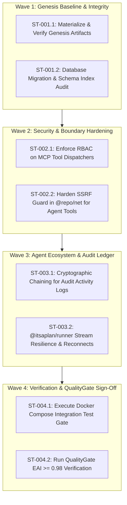

# Sprint 01: Genesis Baseline, Security Hardening & Agent Ecosystem Stabilization

- **Sprint ID**: SPRINT-01
- **Project**: 58_ITSAPLAN (`d:\WORK\01_PROJECTS\58_ITSAPLAN`)
- **Status**: ACTIVE
- **Timebox**: 2026-09-22 -> 2026-10-06 (14 Days)
- **Sprint Goal**: Operationalize Genesis baseline artifacts, harden RBAC/SSRF boundaries across MCP & Agent Tools, implement cryptographic audit log foundation, and verify automated CI/CD Docker test gates.
- **Governing Gates**: Gate GW-GENESIS-01, Gate GW-UTOP-01, Gate GW-UTOP-02, Gate GW-QG-01

---

## Kahn DAG Execution Waves

---

## Detailed Task Breakdown

### Wave 1: Genesis Baseline & Integrity Verification
- [ ] **ST-001.1: Materialize and commit Genesis foundation artifacts**
  - **Owner**: Architect Node
  - **Targets**: `data/itsaplan_bmc.json`, `data/capability_catalog.json`, `data/capability_gaps.json`, `10_ACTIVE_TIMEBOUND/sprint_01_tasks.md`
  - **Acceptance Criteria**: All 4 files exist on disk, JSON files pass strict schema validation, markdown adheres to standard guidelines.
- [ ] **ST-001.2: Database schema index and migration integrity check**
  - **Owner**: Code Node (DB)
  - **Targets**: `packages/db/src/schema/*`, `packages/db/src/migrate.ts`
  - **Acceptance Criteria**: Verify all foreign keys have composite indices, `bun run db:migrate` completes without drift against fresh PostgreSQL container.

### Wave 2: Security & Boundary Hardening (CAP-MCP & CAP-AUTH)
- [ ] **ST-002.1: Audit and enforce RBAC permission matrix on all MCP tool calls**
  - **Owner**: Code Node (API/MCP)
  - **Targets**: `apps/api/src/mcp/dispatch.ts`, `packages/db/src/permissions.ts`
  - **Acceptance Criteria**: Every MCP tool call verifies the calling API key's role permissions (e.g. `work_items:delete`) before executing mutations; unauthorized calls return structured MCP error responses.
- [ ] **ST-002.2: Harden SSRF guards in `@repo/net` for internal agent tools**
  - **Owner**: Code Node (Security)
  - **Targets**: `packages/net/src/*`, `packages/agent-tools/src/tools/*`
  - **Acceptance Criteria**: All agent fetch/scraper tools (Jina, Firecrawl, Webhooks) strictly validate target IPs against RFC1918 private subnets, loopback, and metadata endpoints (169.254.169.254).

### Wave 3: Agent Ecosystem & Audit Ledger (CAP-AGENT & GAP-AUDIT-RETENTION)
- [ ] **ST-003.1: Implement tamper-evident SHA-256 event chaining for audit activity**
  - **Owner**: Code Node (DB/API)
  - **Targets**: `packages/db/src/schema/app.ts`, `apps/api/src/modules/issues/activity.ts`
  - **Acceptance Criteria**: `issue_activity` rows carry `prev_hash` and `hash` fields computed via HMAC/SHA-256 over timestamp, actor, entity, and delta payload.
- [ ] **ST-003.2: Optimize `@itsaplan/runner` event streaming and reconnect logic**
  - **Owner**: Code Node (Runner)
  - **Targets**: `packages/runner/src/*`, `apps/api/src/modules/agents/runs.ts`
  - **Acceptance Criteria**: Runner handles network drops gracefully with exponential backoff reconnects without aborting active CLI process sessions.

### Wave 4: Verification & QualityGate Sign-Off
- [ ] **ST-004.1: Execute Docker Compose Integration Test Gate**
  - **Owner**: Code Node (CI/CD)
  - **Targets**: `docker-compose.test.yml`
  - **Command**: `docker compose -f docker-compose.test.yml run --rm api-test`
  - **Acceptance Criteria**: Zero test failures, zero memory leaks, clean database teardown.
- [ ] **ST-004.2: Run QualityGate EAI >= 0.98 Verification**
  - **Owner**: QualityGate Subagent
  - **Command**: `python ~/.gemini/antigravity/skills/QualityGate/core/scripts/run_quality_gate.py`
  - **Acceptance Criteria**: Evaluation Alignment Index $\text{EAI} \ge 0.98$, zero critical security findings.
