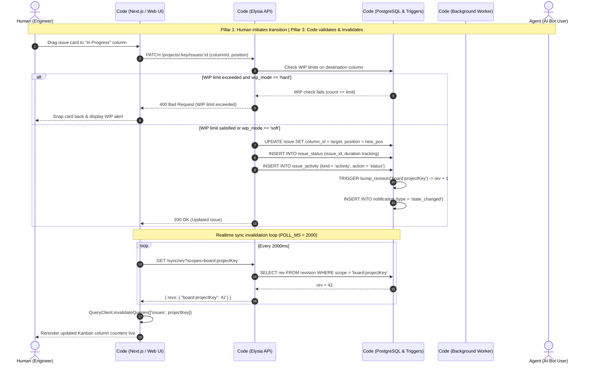
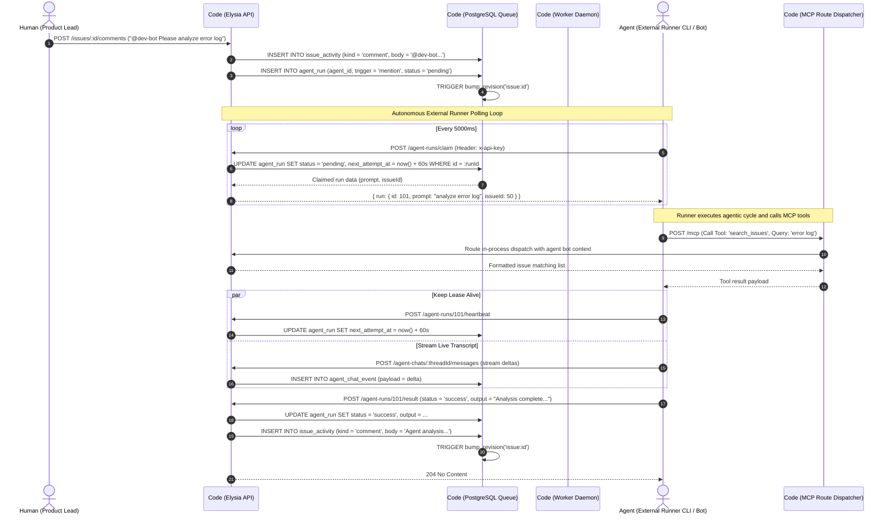
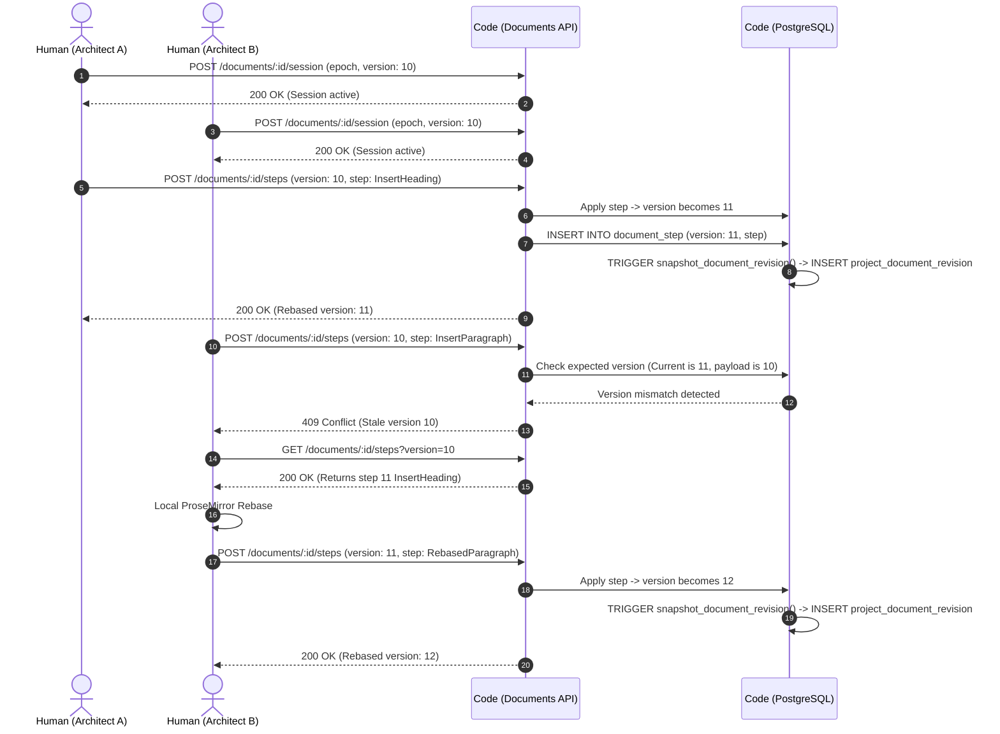

# 3-Pillar BPMN Workflows (Human, Agent, Code)

This document visualizes the 3-pillar interaction topology of **58_ITSAPLAN**:
1. **Human Pillar**: End User (Engineer, Project Lead, Product Manager)
2. **Agent Pillar**: Autonomous AI Agent (Internal Mastra runtime or External Runner CLI)
3. **Code Pillar** ($P \in \{0, 1\}$): Elysia API routes, PostgreSQL Triggers, Outbox Workers, and TanStack SyncProvider.

---

## 1. Issue Progression & Automated Kanban Workflow

---

## 2. Autonomous AI Agent Delegation, Runner Claim, and MCP Tool Execution

---

## 3. Collaborative Document Step Rebasing & Revision Snapshotting

