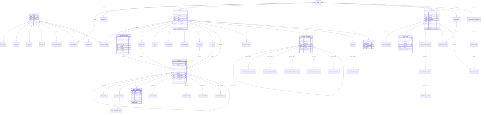

# Entity-Relationship Diagram (ERD) — 58_ITSAPLAN

The following diagram models the core relational database schema defined across `packages/db/src/schema/app.ts`, `auth.ts`, and `scim.ts`.

```mermaid
erDiagram
    %% Auth & User Domain
    USER ||--o{ SESSION : has
    USER ||--o{ ACCOUNT : owns
    USER ||--o{ PASSKEY : registers
    USER ||--o{ APIKEY : holds
    USER ||--o{ USER_PREFERENCE : configures
    USER ||--o{ TEAM_MEMBER : belongs_to
    USER ||--o{ PROJECT_MEMBER : assigned_to

    %% Team & Project Governance
    TEAM ||--o{ TEAM_MEMBER : contains
    TEAM ||--o{ TEAM_ROLE : defines
    TEAM ||--o{ PROJECT : owns
    TEAM ||--o{ AI_AGENT : hosts
    TEAM ||--o{ AGENT_SKILL : catalogs
    TEAM ||--o{ INTEGRATION_CREDENTIAL : stores

    PROJECT ||--o{ PROJECT_MEMBER : has_members
    PROJECT ||--o{ PROJECT_COLUMN : defines_workflow
    PROJECT ||--o{ ISSUE_TYPE : categorizes
    PROJECT ||--o{ LABEL : tags
    PROJECT ||--o{ CUSTOM_FIELD : extends
    PROJECT ||--o{ ISSUE_TEMPLATE : templates
    PROJECT ||--o{ INITIATIVE : groups_strategy
    PROJECT ||--o{ CYCLE : schedules_sprints
    PROJECT ||--o{ ISSUE : tracks_work
    PROJECT ||--o{ PROJECT_VIEW : saves_views
    PROJECT ||--o{ PROJECT_DOCUMENT : documents
    PROJECT ||--o{ WEBHOOK : dispatches
    PROJECT ||--o{ REVISION : tracks_revs

    %% Workflow & Issues
    PROJECT_COLUMN ||--o{ ISSUE : contains
    ISSUE_TYPE ||--o{ ISSUE : classifies
    INITIATIVE ||--o{ ISSUE : groups
    CYCLE ||--o{ ISSUE : contains
    ISSUE ||--o{ ISSUE : parent_of_subtask
    ISSUE ||--o{ ISSUE_LABEL : labeled_with
    ISSUE ||--o{ ISSUE_CHECKLIST : contains
    ISSUE_CHECKLIST ||--o{ ISSUE_CHECKLIST_ITEM : has_items
    ISSUE ||--o{ ISSUE_WORKLOG : logs_time
    ISSUE ||--o{ ISSUE_ACTIVITY : records_history
    ISSUE ||--o{ ISSUE_WATCHER : watched_by
    ISSUE ||--o{ ISSUE_ATTACHMENT : attaches_files
    ISSUE ||--o{ ISSUE_FIELD_VALUE : holds_custom_data

    %% AI Agent & Automation Runtime
    AI_AGENT ||--o{ AGENT_SCHEDULE : triggers_on_cron
    AI_AGENT ||--o{ AGENT_RUN : executes_runs
    AI_AGENT ||--o{ AGENT_CHAT_THREAD : converses_in
    AGENT_CHAT_THREAD ||--o{ AGENT_CHAT_MESSAGE : contains_turns
    AGENT_CHAT_MESSAGE ||--o{ AGENT_CHAT_EVENT : streams_deltas
    AI_AGENT ||--o{ AGENT_SKILL_LINK : enabled_skills
    AGENT_SKILL ||--o{ AGENT_SKILL_LINK : linked_to
    AI_AGENT ||--o{ AGENT_TOOL_LINK : enabled_tools
    AGENT_TOOL ||--o{ AGENT_TOOL_LINK : linked_to
    INTEGRATION_CREDENTIAL ||--o{ AGENT_TOOL : authorizes

    %% Realtime Sync & Outbox
    WEBHOOK ||--o{ WEBHOOK_DELIVERY : queues_dispatches
    USER ||--o{ NOTIFICATION : receives

    %% Knowledge & Documents
    PROJECT_DOCUMENT ||--o{ PROJECT_DOCUMENT : parent_doc_of
    PROJECT_DOCUMENT ||--o{ PROJECT_DOCUMENT_REVISION : version_snapshots
    PROJECT_DOCUMENT ||--o{ PROJECT_DOCUMENT_ISSUE : references_issue
    PROJECT_DOCUMENT ||--o{ PROJECT_DOCUMENT_INITIATIVE : references_initiative
    PROJECT_DOCUMENT ||--o{ DOCUMENT_COLLABORATION : active_session
    PROJECT_DOCUMENT ||--o{ DOCUMENT_COMMENT : inline_comments

    %% Entities attributes
    USER {
        string id PK
        string email UK
        string name
        boolean active
        string role
    }

    PROJECT {
        int id PK
        int team_id FK
        string key UK
        string name
        int next_sequence
        boolean mcp_enabled
        boolean initiatives_enabled
        boolean cycles_enabled
    }

    PROJECT_COLUMN {
        int id PK
        int project_id FK
        string name
        string state_type
        int position
        int wip_limit
        string wip_mode
        string auto_assign_user_id FK
    }

    ISSUE {
        int id PK
        int project_id FK
        int sequence_number
        string title
        int column_id FK
        int parent_id FK
        string assignee_user_id FK
        string delegate_user_id FK
        numeric estimate_points
        int estimate_minutes
    }

    ISSUE_WORKLOG {
        int id PK
        int issue_id FK
        string user_id FK
        int minutes
        date spent_on
        string note
    }

    AI_AGENT {
        int id PK
        int team_id FK
        string user_id FK
        string username
        string kind
        string model
        boolean trigger_on_mention
        boolean trigger_on_assign
    }

    AGENT_RUN {
        int id PK
        int agent_id FK
        int project_id FK
        int issue_id FK
        string status
        timestamp next_attempt_at
        text output
    }

    PROJECT_DOCUMENT {
        int id PK
        int project_id FK
        int parent_id FK
        string title
        int version
        boolean is_private
        string owner_user_id FK
    }

    REVISION {
        string scope PK
        int project_id
        bigint rev
    }
```
