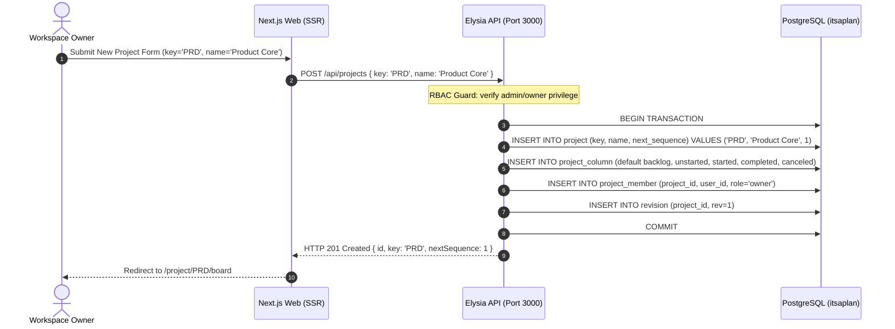
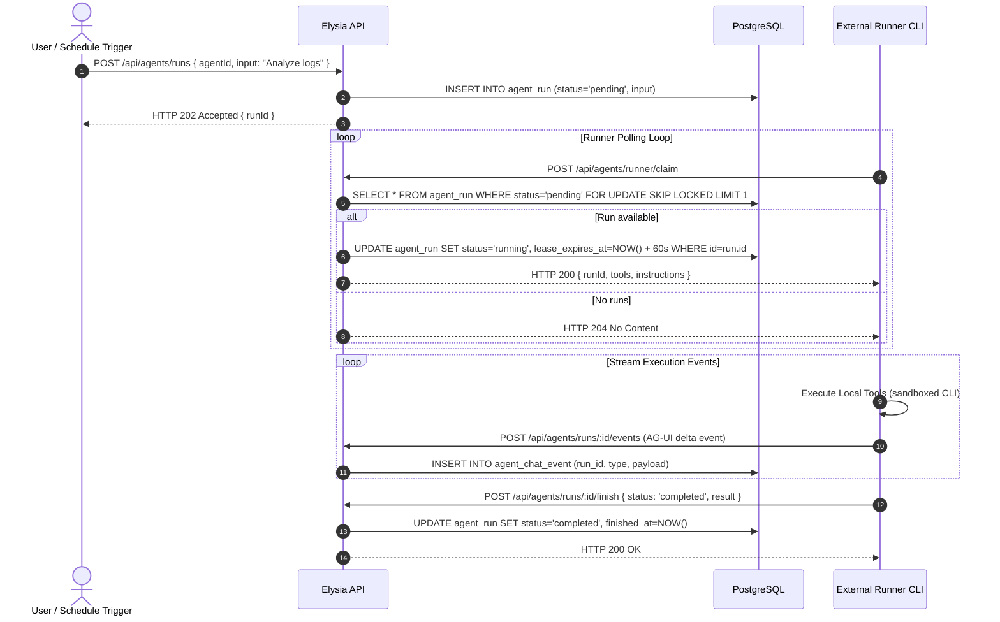
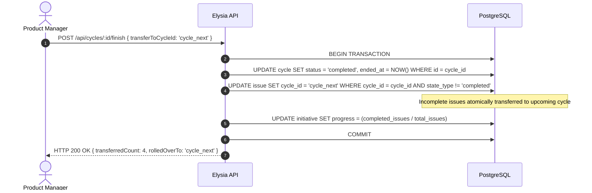
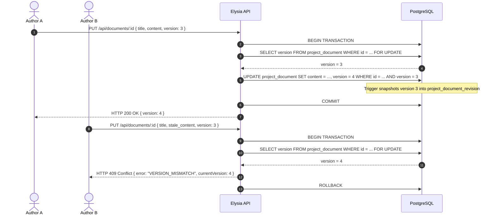

# Architecture Sequence Diagrams (docs/sequence_diagrams.md)

**Classification**: Architecture Specification  
**Standard**: UML 2.5 Sequence Diagrams / UTOP Specification Standard  
**Covers**: `UC-001` through `UC-006`  

---

## 1. UC-001: Project Creation & Sequence Initialization



---

## 2. UC-002: Issue Creation with Atomic Sequence Locking

```mermaid
sequenceDiagram
    autonumber
    actor Member as Team Member
    participant Web as Next.js Web
    participant API as Elysia API
    participant DB as PostgreSQL

    Member->>Web: Create Issue ("Implement SAML SSO")
    Web->>API: POST /api/projects/PRD/issues { title: "Implement SAML SSO" }
    API->>DB: BEGIN TRANSACTION
    API->>DB: SELECT next_sequence FROM project WHERE key = 'PRD' FOR UPDATE
    Note over DB: Row lock acquired on project table
    DB-->>API: next_sequence = 42
    API->>DB: INSERT INTO issue (project_id, sequence=42, title, column_id) VALUES (...)
    API->>DB: UPDATE project SET next_sequence = 43 WHERE key = 'PRD'
    API->>DB: INSERT INTO issue_activity (issue_id, kind='created')
    API->>DB: COMMIT
    Note over DB: Row lock released; revision trigger bumps rev counter
    API-->>Web: HTTP 201 Created { id, key: 'PRD-42', title }
    Web-->>Member: Render PRD-42 on Kanban board
```

---

## 3. UC-003: AI Agent Execution with Leased Runner Claim



---

## 4. UC-004: Realtime Revision Synchronization

```mermaid
sequenceDiagram
    autonumber
    actor ClientA as Browser Tab A (Mutator)
    actor ClientB as Browser Tab B (Observer)
    participant API as Elysia API
    participant DB as PostgreSQL
    participant Sync as SyncProvider (TanStack Query)

    ClientA->>API: PATCH /api/issues/PRD-42 { columnId: 'started' }
    API->>DB: UPDATE issue SET column_id = 'started' WHERE id = ...
    Note over DB: PostgreSQL trigger executes: issue_rev()
    DB->>DB: UPDATE revision SET rev = rev + 1 WHERE project_id = ...
    DB-->>API: OK (New rev = 105)
    API-->>ClientA: HTTP 200 OK

    ClientB->>Sync: SyncProvider heartbeat poll (lastKnownRev = 104)
    Sync->>API: GET /api/sync/pull?rev=104
    API->>DB: SELECT * FROM revision WHERE project_id = ...
    DB-->>API: Current rev = 105
    API->>DB: SELECT * FROM issue WHERE updated_at > last_sync_time
    DB-->>API: [ { id: 'PRD-42', columnId: 'started' } ]
    API-->>Sync: HTTP 200 { rev: 105, mutations: [...] }
    Sync-->>ClientB: Invalidate TanStack query cache; UI updates card position
```

---

## 5. UC-005: Initiative Rollup & Cycle Scope Rollover



---

## 6. UC-006: Document Optimistic Locking & Revision Retention


